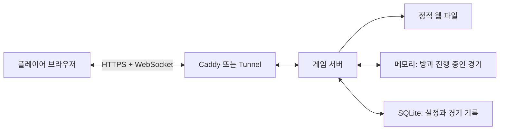

# 브라우저 기반 소셜 디덕션 게임 설계

## 1. 목표와 범위

개인 PC 한 대에서 게임 서버와 웹 페이지를 실행한다. 플레이어는 설치 없이 최신 브라우저로 주소에 접속해 닉네임을 정하고 방에 참가한다.

첫 번째 버전(MVP)의 목표는 다음과 같다.

- 4~10명이 방 코드로 참가
- 대기실, 준비, 게임 시작
- 이동과 다른 플레이어 위치 동기화
- 시민/배신자 역할의 비공개 배정
- 간단한 임무 2~3종
- 제거, 신고, 회의, 채팅, 투표
- 승리 조건 판정과 결과 화면
- 연결이 잠시 끊긴 플레이어의 재접속

음성 채팅, 계정, 친구, 랭킹, 스킨 상점, 맵 에디터는 MVP 이후로 미룬다.

## 2. 권장 기술 구성

| 영역 | 선택 | 이유 |
|---|---|---|
| 웹 클라이언트 | React + TypeScript + Vite | 화면과 게임 UI를 빠르게 개발하고 브라우저 배포가 단순함 |
| 2D 게임 화면 | Phaser | 이동, 충돌, 카메라, 애니메이션을 직접 처음부터 만들 필요가 적음 |
| 서버 | Node.js + TypeScript + Fastify | 웹 페이지/API와 실시간 게임 로직을 한 언어로 관리 가능 |
| 실시간 통신 | Socket.IO(WebSocket 우선) | 방 관리, 재접속, 브라우저 호환 처리가 편리함 |
| 영구 저장 | SQLite + Drizzle ORM | 개인 PC용으로 운영과 백업이 단순함 |
| 실행/배포 | Docker Compose | 서버 이전, 재시작, 버전 고정이 쉬움 |
| HTTPS/외부 접속 | Caddy + 도메인 또는 Cloudflare Tunnel | 브라우저 보안 요구사항을 만족시키고 공유 주소를 만들기 쉬움 |

초기 게임 중 상태는 메모리에 둔다. SQLite에는 운영 설정, 금지 사용자, 경기 요약처럼 서버를 재시작해도 남겨야 하는 정보만 저장한다. 진행 중인 게임까지 DB에 매 프레임 저장하면 복잡도와 지연이 불필요하게 커진다.

## 3. 전체 구조



운영 단위는 처음에는 하나의 서버 프로세스로 유지한다. 여러 서버로 분산하면 방을 찾기 위한 별도 시스템이 필요하므로, 개인 PC에서 수십 명 규모인 동안에는 이점이 없다.

## 4. 서버 권한 원칙

서버가 게임의 유일한 판정자(authoritative server)다.

- 클라이언트는 `오른쪽으로 이동 중`, `신고 버튼 클릭` 같은 의도만 보낸다.
- 서버가 속도, 충돌, 거리, 생존 여부, 쿨다운을 검사한다.
- 역할, 실제 위치, 임무 완료, 투표 결과와 승패는 서버가 결정한다.
- 각 플레이어에게 필요한 정보만 보낸다. 다른 사람의 역할이나 배신자 전용 정보는 일반 플레이어에게 전송하지 않는다.

이 원칙을 지켜야 브라우저 개발자 도구로 값을 바꾸는 가장 단순한 치팅을 막을 수 있다.

## 5. 게임 상태 모델

### 방 상태

`LOBBY -> STARTING -> PLAYING -> MEETING -> PLAYING -> ENDED`

- `LOBBY`: 참가, 퇴장, 준비, 방 설정 변경
- `STARTING`: 역할과 임무 배정, 맵 초기화, 카운트다운
- `PLAYING`: 이동, 임무, 방해, 제거, 신고
- `MEETING`: 이동 정지, 토론, 투표, 결과 공개
- `ENDED`: 승리 팀 표시 후 대기실 복귀

### 주요 객체

- `Room`: 방 코드, 방장, 설정, 현재 단계, 플레이어 목록
- `Player`: 공개 ID, 닉네임, 색상, 생존 여부, 연결 상태
- `SecretPlayerState`: 역할, 임무, 능력 쿨다운
- `GameWorld`: 플레이어 위치, 시체, 문/장치 상태, 방해 상태
- `Meeting`: 신고자, 원인, 종료 시각, 투표 목록

비밀 상태는 공개 상태와 자료 구조부터 분리한다. 전체 방 객체를 그대로 직렬화해 전송하는 실수를 예방하기 위해서다.

## 6. 실시간 동기화 방식

- 서버 게임 루프: 초당 20회(20 Hz)
- 위치 스냅샷 전송: 초당 10~15회
- 클라이언트 화면: 60 FPS로 보간하여 부드럽게 표시
- 입력 메시지에는 증가하는 `sequence` 번호 포함
- 중요한 이벤트(신고, 투표, 임무 완료)는 요청/응답 방식으로 성공 또는 거절 이유를 반환
- 10~20초마다 연결 상태 확인
- 연결이 끊기면 30초간 자리를 보존하고 재접속 토큰으로 복귀

MVP에서는 정교한 예측보다 보간을 먼저 적용한다. 이동감이 부족할 때 로컬 플레이어에만 클라이언트 예측과 서버 보정을 추가한다.

## 7. 실시간 메시지 초안

### 클라이언트에서 서버로

| 이벤트 | 핵심 데이터 |
|---|---|
| `room:create` | 닉네임, 외형 |
| `room:join` | 방 코드, 닉네임, 외형 |
| `room:ready` | 준비 여부 |
| `game:start` | 없음(방장만 가능) |
| `player:input` | sequence, 방향, 입력 시각 |
| `action:interact` | 대상 ID |
| `action:report` | 대상 시체 ID |
| `action:eliminate` | 대상 플레이어 ID |
| `task:complete` | 임무 ID, 검증 데이터 |
| `meeting:chat` | 메시지 |
| `meeting:vote` | 대상 플레이어 ID 또는 기권 |
| `session:resume` | 재접속 토큰 |

### 서버에서 클라이언트로

| 이벤트 | 핵심 데이터 |
|---|---|
| `room:state` | 공개 대기실 상태 |
| `game:assigned` | 본인의 역할과 임무 |
| `world:snapshot` | 틱 번호, 보이는 세계 상태 |
| `game:event` | 제거, 방해, 문, 임무 게이지 변화 |
| `meeting:started` | 신고 정보, 참가자, 종료 시각 |
| `meeting:result` | 득표와 퇴장 결과 |
| `game:ended` | 승리 팀, 경기 요약 |
| `request:rejected` | 요청 ID, 거절 코드 |

모든 메시지는 런타임 스키마로 검증하고 크기 제한을 둔다. 채팅에는 빈도 제한과 최대 글자 수를 적용한다.

## 8. 웹 화면 구성

1. **접속 화면**: 닉네임/색상 선택, 방 만들기, 방 코드 참가
2. **대기실**: 참가자 목록, 준비 상태, 방 설정, 초대 코드
3. **게임 화면**: 맵, 캐릭터, 임무 목록, 상호작용 버튼, 최소한의 HUD
4. **임무 화면**: 전체 화면 또는 모달 형태의 짧은 미니게임
5. **회의 화면**: 토론 타이머, 생존자 목록, 채팅, 투표
6. **결과 화면**: 승리 팀, 역할 공개, 다시 하기

키보드(WASD/방향키), 터치 가상 스틱, 버튼 입력을 같은 `InputState`로 변환해 서버에 보낸다. 반응형 UI는 가로 화면을 기본으로 하되 휴대폰에서도 플레이 가능하도록 한다.

## 9. 권장 프로젝트 구조

```text
amongUs/
  apps/
    web/                 # React, Phaser, 게임 화면과 UI
    server/              # Fastify, Socket.IO, 게임 루프
  packages/
    protocol/            # 메시지 타입과 검증 스키마
    game-core/           # 순수 게임 규칙, 승리 판정, 투표 계산
  data/                  # SQLite 파일(소스 관리 제외)
  deploy/
    Caddyfile
  docker-compose.yml
  .env.example
```

`protocol`을 서버와 웹이 함께 사용하면 이벤트 이름이나 데이터 모양이 서로 어긋나는 문제를 줄일 수 있다. `game-core`는 네트워크 없이 단위 테스트할 수 있게 만든다.

## 10. 개인 PC 운영 방식

### 집 안에서만 플레이

서버 PC의 내부 IP와 포트로 접속한다. 공유기에서 서버 PC에 고정 내부 IP를 할당하면 주소가 바뀌지 않는다.

### 인터넷 친구와 플레이

권장 순서는 다음과 같다.

1. 도메인 또는 Tunnel 주소를 준비한다.
2. 외부에는 HTTPS 443만 공개한다.
3. Caddy/Tunnel이 내부 게임 서버로 전달한다.
4. 운영 화면과 SQLite 파일은 외부에 직접 공개하지 않는다.

공유기 포트 포워딩을 쓸 경우 PC 방화벽, 자동 보안 업데이트, 강한 관리자 비밀번호가 필요하다. 공유기 설정이 어렵거나 공인 IP가 없는 환경에서는 Tunnel 방식이 간단하다. 무료 서비스 정책은 바뀔 수 있으므로 실제 배포 단계에서 확인한다.

### 예상 성능

맵 하나, 방당 10명, 위치 전송 10~15 Hz라면 일반적인 개인 PC 한 대로 여러 방을 운영할 수 있다. 실제 한계는 CPU보다 업로드 대역폭, Wi-Fi 품질, 구현 방식에 좌우되므로 10명/30명/50명 부하 테스트로 결정한다.

## 11. 보안과 운영 체크

- 방 코드는 추측 공격을 줄일 수 있도록 충분한 조합을 사용하고 참가 시도 횟수를 제한
- 닉네임/채팅 길이 제한, 금칙어 및 HTML 이스케이프
- IP와 소켓 단위 요청 빈도 제한
- 이동 속도, 행동 거리, 쿨다운을 서버에서 재검사
- 관리자 기능은 별도 비밀키와 내부망 접근으로 제한
- 로그에 재접속 토큰이나 비밀키를 남기지 않음
- SQLite와 설정 파일을 주기적으로 백업
- 서버 종료 신호를 받으면 새 게임을 막고 진행 중 방을 안전하게 종료
- 컨테이너 자동 재시작과 상태 확인 적용

## 12. 테스트 전략

- `game-core` 단위 테스트: 역할 배정, 동률 투표, 승리 조건, 쿨다운
- 프로토콜 테스트: 잘못된 메시지 거절, 비밀 정보 누출 방지
- 통합 테스트: 방 생성부터 결과 화면까지 가상 플레이어로 진행
- 연결 테스트: 지연, 패킷 손실, 재접속, 방장 퇴장
- 부하 테스트: 10/30/50명 동시 이동과 회의
- 실제 브라우저 테스트: 데스크톱 Chrome/Edge/Safari, Android/iOS

## 13. MVP 개발 순서

### 1단계: 뼈대와 대기실

- 모노레포, 공용 프로토콜, 서버 상태 확인
- 닉네임 입력, 방 생성/참가, 준비, 방장 이전
- 재접속 토큰

### 2단계: 이동 가능한 맵

- 테스트용 독자 맵 1개
- 키보드/터치 이동, 충돌, 카메라
- 서버 위치 판정과 다른 플레이어 보간

### 3단계: 핵심 게임 규칙

- 역할 비공개 배정
- 임무 2~3종, 제거와 시체, 신고
- 회의 채팅, 투표, 퇴장, 승리 판정

### 4단계: 운영 가능 상태

- Docker Compose와 HTTPS 진입점
- 로그, 설정, 백업, 정상 종료
- 자동 테스트와 소규모 부하 테스트

### 5단계: 플레이 테스트 개선

- 이동감과 네트워크 보정
- 맵 동선, 쿨다운, 임무 수 밸런스
- 접근성, 모바일 조작, 오류 안내

## 14. 첫 구현에서 확정할 기본값

- 인원: 4~10명
- 방 코드: 혼동 문자를 뺀 영문 대문자 6자리
- 배신자: 4~6명일 때 1명, 7~10명일 때 설정으로 1~2명
- 이동 동기화: 서버 20 Hz, 스냅샷 12 Hz
- 회의 토론 45초, 투표 30초
- 재접속 유예 30초
- 한 방의 채팅 메시지 최대 200자
- 서버 재시작 시 진행 중 경기는 종료, 방 설정과 경기 요약만 보존

이 기본값은 첫 플레이 테스트를 위한 출발점이며, 코드에 흩어 놓지 않고 방 설정 스키마 한 곳에서 관리한다.
